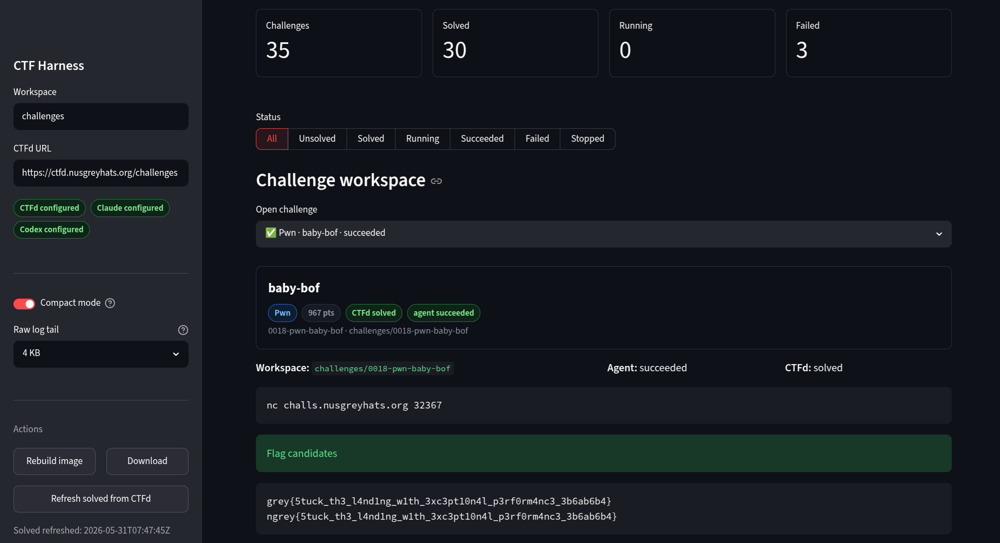
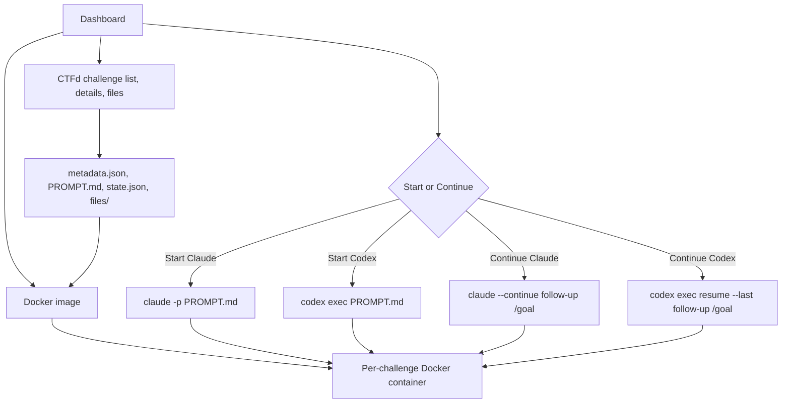

# Clank the Flag

Clank the Flag is a Streamlit dashboard for downloading CTFd challenges and
solving them with Claude Code or Codex inside per-challenge Docker containers
equipped with common CTF tools.



## Flow



## The `/goal` Loop

Every downloaded challenge gets a `PROMPT.md` generated from CTFd metadata,
attachments, hints, tags, and connection info. The prompt starts with a `/goal`
line such as `Solve the CTF challenge ... and recover the flag`, followed by
tooling context and the expected final answer.

`Start Claude` and `Start Codex` pass that prompt into the selected agent inside
a Docker container. The challenge directory is mounted at `/workspace`, while
`.agent-home/` inside the challenge workspace persists the agent home directory
across runs.

`Continue Claude` and `Continue Codex` replace the initial prompt with a new
`/goal Continue solving ...` prompt plus the follow-up text from the dashboard.
Claude is invoked with `--continue`; Codex attempts `codex exec resume --last`
when a prior Codex session exists and falls back to a fresh exec session
otherwise.

Candidate flags are identified in agent output using a regex and shown in the dashboard.

## Usage

```bash
uv run streamlit run streamlit_app.py
```

Open `http://127.0.0.1:8765`.

From the dashboard you can:

- Build the Docker image with common CTF tools and Claude Code.
- Enter a CTFd URL and download challenges.
- Start Claude for an individual challenge.
- Start Codex for an individual challenge.
- Continue prompting a specific challenge.
- Monitor status, logs, final messages, and detected flag candidates.

## Configuration

The harness loads a local `.env` file if present. Do not commit `.env`,
downloaded `challenges/`, logs, or agent homes.

```bash
CTFD_TOKEN=...
CTFD_COOKIE='session=...'

ANTHROPIC_API_KEY=...
ANTHROPIC_AUTH_TOKEN=...
CTF_HARNESS_CLAUDE_PARTIAL_MESSAGES=1

OPENAI_API_KEY=...
CODEX_ACCESS_TOKEN=...
OPENAI_OAUTH_TOKEN=...
CTF_HARNESS_CODEX_MODEL=gpt-5.4
```

### Claude Code

If you have an Anthropic API key, use:

```bash
ANTHROPIC_API_KEY=sk-ant-...
```

If you use Claude Code subscription/OAuth auth instead, run this on the host:

```bash
claude setup-token
```

Put the resulting long-lived token in `.env` as:

```bash
ANTHROPIC_AUTH_TOKEN=...
```

When Claude starts in a challenge container, the harness passes
`ANTHROPIC_API_KEY` or `ANTHROPIC_AUTH_TOKEN` through to Docker. The token value
is masked in harness logs and challenge state.

Claude runs with `--output-format stream-json` but does not request partial
message deltas by default. This keeps long generated Bash commands and heredocs
from filling `claude.log` with thousands of tiny `input_json_delta` records. Set
`CTF_HARNESS_CLAUDE_PARTIAL_MESSAGES=1` only when you need those raw partial
events for debugging.

### Codex

If you have an OpenAI API key, use:

```bash
OPENAI_API_KEY=sk-...
```

If you use ChatGPT subscription/OAuth auth instead, run this on the host:

```bash
codex login
```

The harness will copy `~/.codex/auth.json` into the per-challenge agent home
before starting Docker.

Alternatively, you can copy the access token from `~/.codex/auth.json` yourself
and put it in `.env` as:

```bash
CODEX_ACCESS_TOKEN=...
```

In this case, the harness will run `codex login --with-access-token` inside the
container.

The harness passes `--model gpt-5.4` to Codex by default. If you have done KYC
and have access to Trusted Access for Cyber, then GPT-5.5 is the better model.
You can override the model choice with `CTF_HARNESS_CODEX_MODEL=...`.
